```R
library(ggplot2)  
library(lubridate)
suppressMessages(library(astsa))
suppressMessages(library(tseries))
suppressMessages(library(forecast))
```

# Time Series Modeling and Forcasting using Apple Data 


```R
AppleMonthlStack <- read.csv("C:/Users/selamina/Desktop/Second Yr Copy 1/Yr2 Semester 2/Time Series/Project/Apple1990toNowMonthStack.csv")
AppleOpenPrice=cbind.data.frame(Date=mdy(AppleMonthlStack[,1]),OpenPrice=AppleMonthlStack[,2])
```


```R
head(AppleOpenPrice,2)
```


<table>
<thead><tr><th></th><th scope=col>Date</th><th scope=col>OpenPrice</th></tr></thead>
<tbody>
	<tr><th scope=row>1</th><td>1990-01-02</td><td>35.25</td></tr>
	<tr><th scope=row>2</th><td>1990-02-01</td><td>34.5</td></tr>
</tbody>
</table>


```R
AppleOpenPriceFinal=AppleOpenPrice[c(183:294),] # 112 Total Observation begining 2005-03-01
```


```R
head(AppleOpenPriceFinal,2)
```


<table>
<thead><tr><th></th><th scope=col>Date</th><th scope=col>OpenPrice</th></tr></thead>
<tbody>
	<tr><th scope=row>183</th><td>2005-03-01</td><td>44.99</td></tr>
	<tr><th scope=row>184</th><td>2005-04-01</td><td>42.09</td></tr>
</tbody>
</table>


```R
tailForcast=tail(AppleOpenPriceFinal,10)# last 10 obs for forcast
ggplot(AppleOpenPriceFinal, aes(Date, OpenPrice))+ geom_line()+ 
      labs(y="stock Price (USD)",x="monthly Stock: 2005-03-01 to 2014-06-02",title="From 2005-03-01 to 2014-06-02")+
      theme(axis.text.x=element_text(angle = 45, size = 14,face="bold"))+
      geom_line(data=tailForcast,aes(Date,OpenPrice),color='red',size=1.5) # just red once will be kept for forcasting
AppleOpenPrice=ts(head(AppleOpenPriceFinal[,2],-10)) # keeping the bottom 10 for Forcasting

```


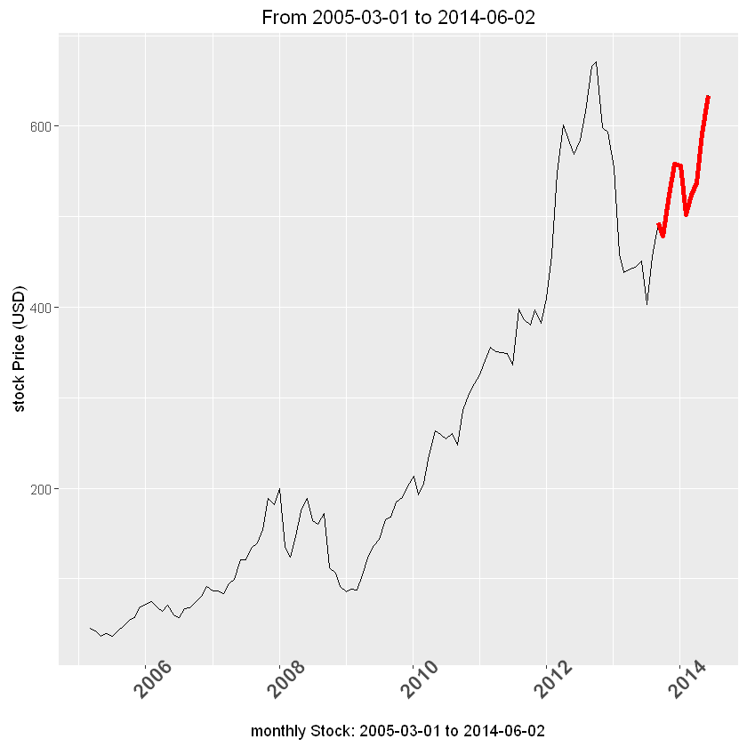


```R
head(AppleOpenPrice,2)
```


<ol class=list-inline>
	<li>44.989998</li>
	<li>42.09</li>
</ol>


### Stationarity Check 


```R
adf.test(AppleOpenPrice, alternative="stationary") 
```


    
    	Augmented Dickey-Fuller Test
    
    data:  AppleOpenPrice
    Dickey-Fuller = -2.1717, Lag order = 4, p-value = 0.5055
    alternative hypothesis: stationary
    


```R
message("The adf.test results a p-value of 0.5055,
which indicates as the original data is not Stationary at 5% level of significance.")
```

    The adf.test results a p-value of 0.5055,
    which indicates as the original data is not Stationary at 5% level of significance.
    


```R
par(mfrow=c(1,2))
acf(AppleOpenPrice,100);pacf(AppleOpenPrice,100)
message("The slow decline in the ACF plot indicates as the observations are correlated or
not independent and also the immediate cut in the PACF plot also confirms that. 
Thus, the origional data is not Stationary.")
```

    The slow decline in the ACF plot indicates as the observations are correlated or
    not independent and also the immediate cut in the PACF plot also confirms that. 
    Thus, the origional data is not Stationary.
    


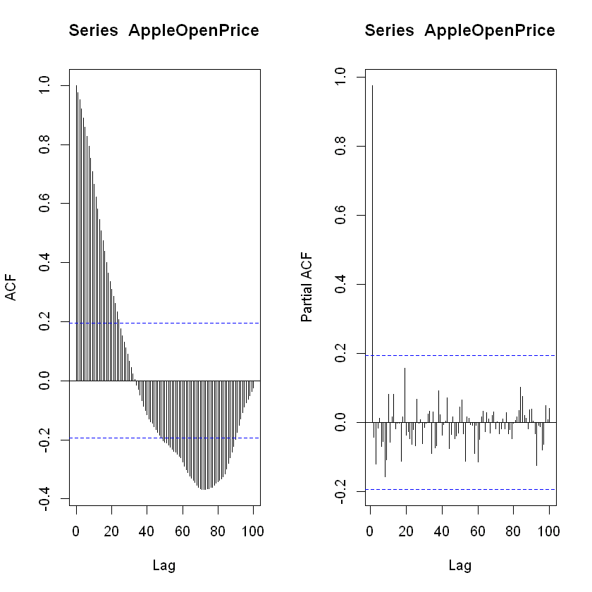


## Stationarity Solution


```R
message("Clearly the trend of Apple Stock price in the time series plot indicates an upward parabola. 
This shows as we could take log transformation with or with out lag 1 differencing to stablize and
make the time series plot stationary.")
```

    Clearly the trend of Apple Stock price in the time series plot indicates an upward parabola. 
    This shows as we could take log transformation with or with out lag 1 differencing to stablize and make the time series plot stationary.
    


```R
AppleOpenPricelog=log(AppleOpenPrice)
plot(AppleOpenPricelog,main="Log of the Open price")
AppleOpenPriceD1 = diff(AppleOpenPrice, 1)
plot(AppleOpenPriceD1,main="Lag 1 differenced Open Price")
AppleOpenPricelogD1 = diff(AppleOpenPricelog, 1)
plot(AppleOpenPricelogD1,main="Lag 1 difference of log(Open Price) ")

message("Stationarity Test after lag-1 difference of the log(Open-Price)")
adf.test(AppleOpenPricelogD1, alternative="stationary")
par(mfrow=c(1,2))
acf(AppleOpenPricelogD1,100);pacf(AppleOpenPricelogD1,100)
message("The adf.test and both ACF and PACF confirms that the transformed data is stationary both in mean and variance. ")

```


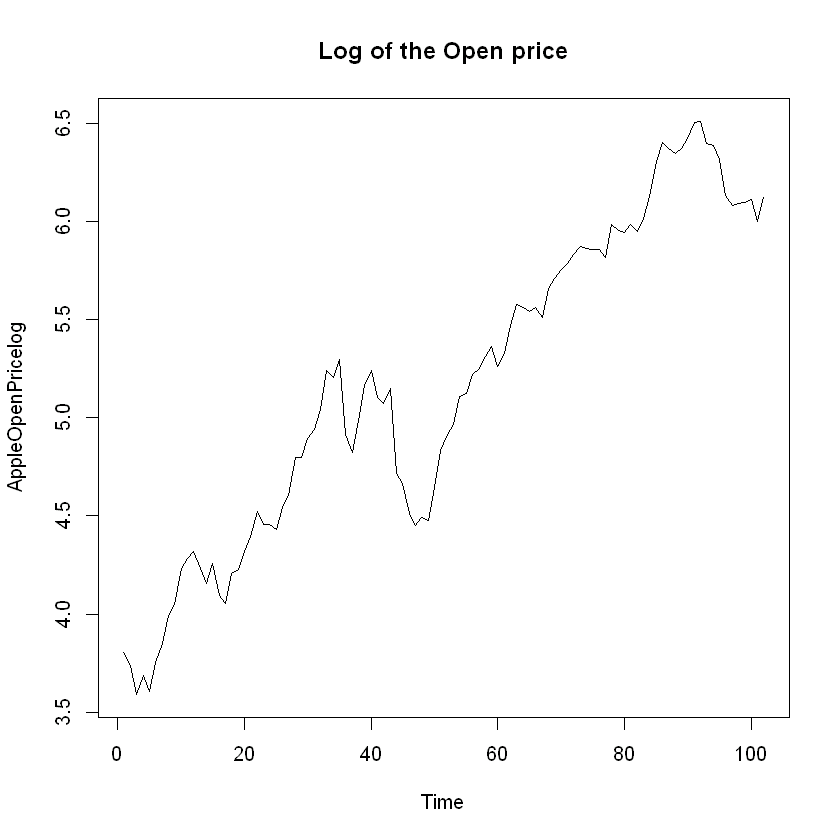


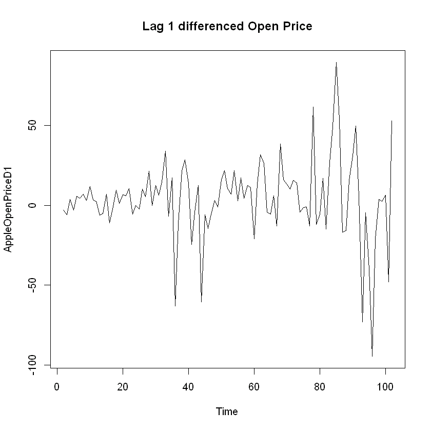


    Stationarity Test after lag-1 difference of the log(Open-Price)
    Warning message:
    In adf.test(AppleOpenPricelogD1, alternative = "stationary"): p-value smaller than printed p-value


    
    	Augmented Dickey-Fuller Test
    
    data:  AppleOpenPricelogD1
    Dickey-Fuller = -4.252, Lag order = 4, p-value = 0.01
    alternative hypothesis: stationary
    


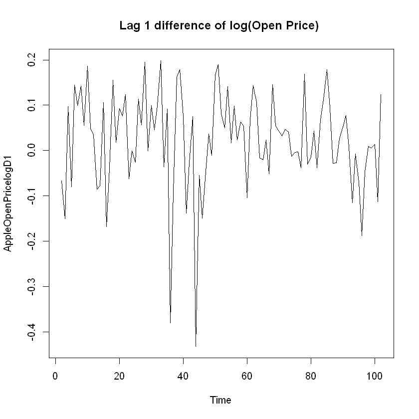


    The adf.test and both ACF and PACF confirms that the transformed data is stationary both in mean and variance. 
    


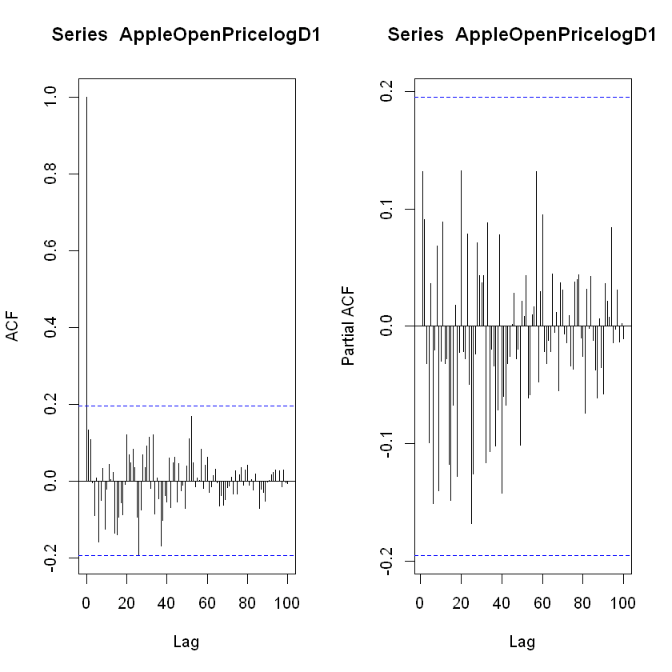


# Model Selection


```R
par(mfrow=c(1,2))
acf(AppleOpenPricelogD1,100);pacf(AppleOpenPricelogD1,100)
message("From the ACF and PACF plot its clear that the tranformed data is White Noise.")

```

    From the ACF and PACF plot its clear that the tranformed data is White Noise.
    


```R
Model1p0d1q0=Arima(AppleOpenPricelog, order=c(0, 1, 0))
tsdiag(Model1p0d1q0)
Model1p0d1q0
message("As we can see in the time series diagram output, our model is a valid or acceptable for the following reasons. 
The standardized Residials plot support a randome residuals with center or mean Zero.
The ACF of the residual confirms as the residuals are White Noise. 
All the p-values of the Ljung-box statistics are way above the boundary which confirms the non independence of the residuals.")

```


    Series: AppleOpenPricelog 
    ARIMA(0,1,0)                    
    
    sigma^2 estimated as 0.012:  log likelihood=80.05
    AIC=-158.09   AICc=-158.05   BIC=-155.48


    As we can see in the time series diagram output, our model is a valid or acceptable for the following reasons. 
    The ACF of the residual confirms as the residuals are White Noise. 
    All the p-values of the Ljung-box statistics are way above the boundary which confirms the non independence of the residuals.
    


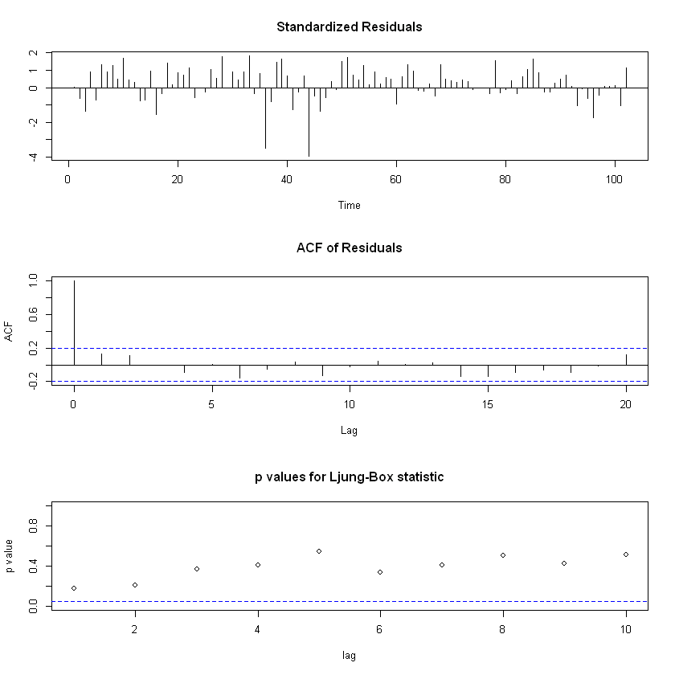


## Residual Assesment 


```R
fittedActual=cbind.data.frame(fit=as.numeric(exp(fitted(Model1p0d1q0))),Date=head(AppleOpenPriceFinal[,1],-10),
                              OpenPrice=as.numeric(exp(AppleOpenPricelog))) 

ggplot(fittedActual, aes(Date, OpenPrice)) + geom_line() +
labs(y="stock Price (USD)",title="monthly Stock: 2005-03-01 to 2014-06-02",x="Black line=Actual Values; Red line= Fitted values")+
theme(axis.text.x=element_text(angle = 45, size = 14,face="bold"))+geom_line(data=fittedActual,aes(Date,fit),color='red',size=1)

res=as.numeric(Model1p0d1q0$residuals)
plot(Model1p0d1q0$residuals, main="Residuals Plot")
hist(Model1p0d1q0$residuals, main="Residuals plot")

qqnorm(res,pch=16) 
qqline(res,col="red",lwd=4,lty=2)

message("Compute the Box-Pierce or Ljung-Box test statistic for examining the null hypothesis of independence 
         in a given time series.")
Box.test(Model1p0d1q0$residuals, lag=1)
```


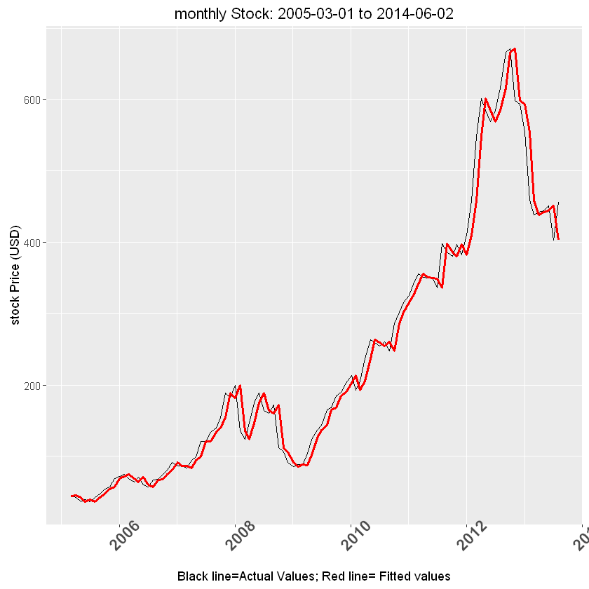


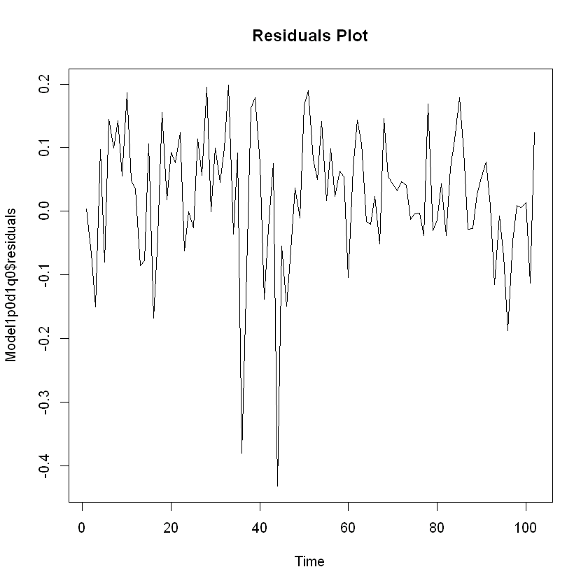


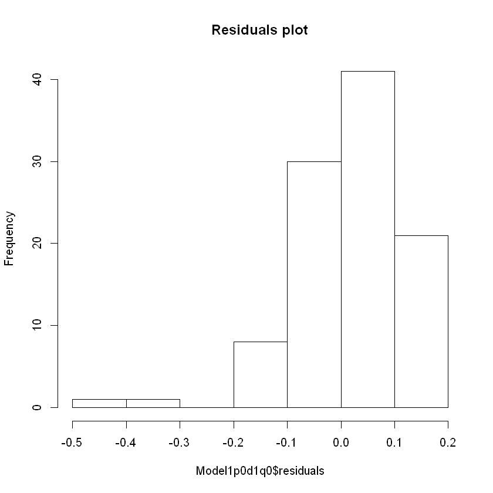


    Compute the Box-Pierce or Ljung-Box test statistic for examining the null hypothesis of independence in a given time series.
    


    
    	Box-Pierce test
    
    data:  Model1p0d1q0$residuals
    X-squared = 1.8105, df = 1, p-value = 0.1785
    


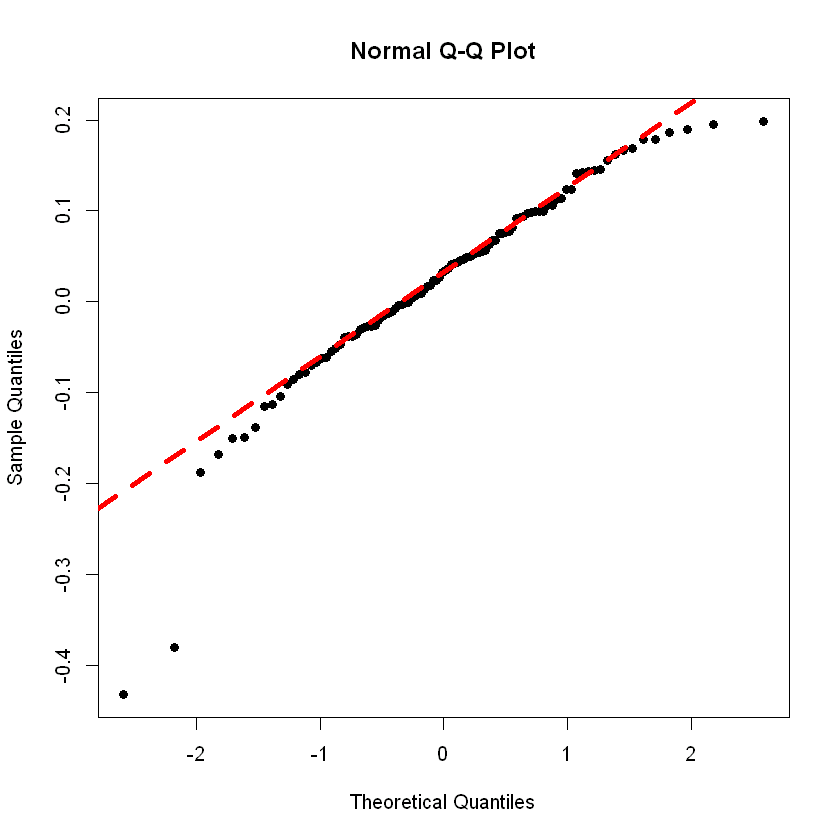


## Forcast


```R
forcast=forecast.Arima(Model1p0d1q0, h=10, level=c(99.75))
forcast=exp(data.frame(forcast))
forcastOriginal=cbind(tailForcast,forcast)
ggplot(forcastOriginal, aes(Date, OpenPrice)) + geom_line() + 
labs(y="stock Price (USD)",title="Apple Stock price forcast for 10 consecutive months",x="Black line=Actual Values;Green 
                                  line=Forcasted Values; Red line= 95% confidence intervale")+
theme(axis.text.x=element_text(angle = 45, size = 14,face="bold"))+
geom_line(data=forcastOriginal,aes(Date,Lo.99.75),color='red',size=1)+
geom_line(data=forcastOriginal,aes(Date,Hi.99.75),color='red',size=1)+
geom_line(data=forcastOriginal,aes(Date,Point.Forecast),color='green',size=1)
forcastOriginal
```


<table>
<thead><tr><th></th><th scope=col>Date</th><th scope=col>OpenPrice</th><th scope=col>Point.Forecast</th><th scope=col>Lo.99.75</th><th scope=col>Hi.99.75</th></tr></thead>
<tbody>
	<tr><th scope=row>285</th><td>2013-09-03</td><td>493.1</td><td>455.75</td><td>327.2664</td><td>634.6757</td></tr>
	<tr><th scope=row>286</th><td>2013-10-01</td><td>478.45</td><td>455.75</td><td>285.3166</td><td>727.9913</td></tr>
	<tr><th scope=row>287</th><td>2013-11-01</td><td>524.02</td><td>455.75</td><td>256.8113</td><td>808.7964</td></tr>
	<tr><th scope=row>288</th><td>2013-12-02</td><td>558</td><td>455.75</td><td>235.0045</td><td>883.8469</td></tr>
	<tr><th scope=row>289</th><td>2014-01-02</td><td>555.68</td><td>455.75</td><td>217.332</td><td>955.7175</td></tr>
	<tr><th scope=row>290</th><td>2014-02-03</td><td>502.61</td><td>455.75</td><td>202.5015</td><td>1025.711</td></tr>
	<tr><th scope=row>291</th><td>2014-03-03</td><td>523.42</td><td>455.75</td><td>189.7584</td><td>1094.592</td></tr>
	<tr><th scope=row>292</th><td>2014-04-01</td><td>537.76</td><td>455.75</td><td>178.619</td><td>1162.855</td></tr>
	<tr><th scope=row>293</th><td>2014-05-01</td><td>592</td><td>455.75</td><td>168.7528</td><td>1230.842</td></tr>
	<tr><th scope=row>294</th><td>2014-06-02</td><td>633.96</td><td>455.75</td><td>159.9232</td><td>1298.799</td></tr>
</tbody>
</table>


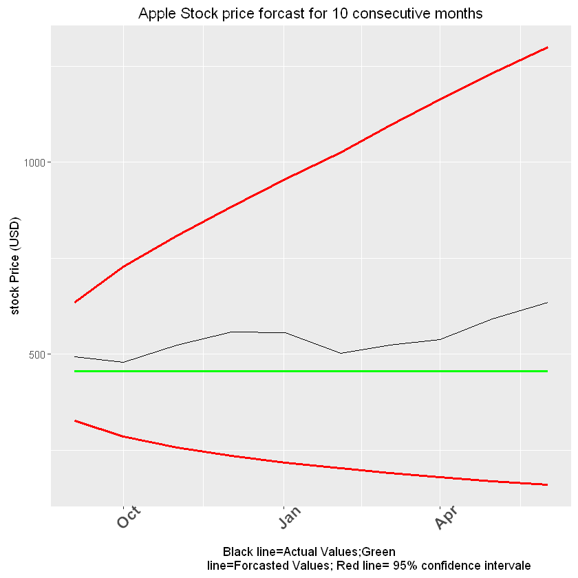


```R

```
